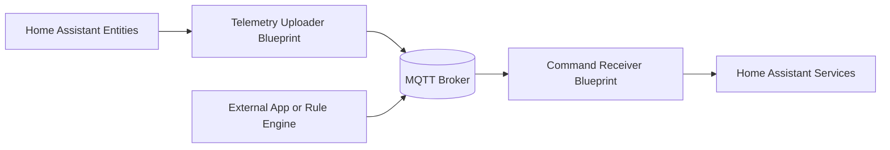

# Universal Local-First MQTT Blueprints for Home Assistant

[](https://github.com/http418imateapot/homeassistant-mqtt-blueprints/actions/workflows/blueprint-ci.yml)
[](https://github.com/http418imateapot/homeassistant-mqtt-blueprints/actions/workflows/release.yml)
[](https://github.com/http418imateapot/homeassistant-mqtt-blueprints/releases)

A plug-and-play blueprint set for bridging Home Assistant entities with a local MQTT broker.

- Local-first design: no cloud lock-in and no virtual helper sensors required.
- Standard topic structure for telemetry and commands.
- Clean JSON payloads for easy integration with gateways, dashboards, and rule engines.

## Blueprints

1. mqtt_telemetry_uploader.yaml
2. mqtt_command_receiver.yaml

## Architecture



## Current Design Snapshot

This is the current design baseline for open-source release:

- Telemetry uploader groups selected entities by area and domain internally, then publishes strict per-domain JSON payloads.
- Telemetry uploader publishes retained MQTT Discovery configs per selected entity and retained capability metadata.
- Command receiver is schema v2 first and dispatches Home Assistant-native service calls using `service`, `target`, and `data`.
- Command receiver includes whitelist controls by area and domain:
  - Area filter: `All Areas` + `Allowed Areas`
  - Domain filter: `Allowed Domains` (`all`, `climate`, `cover`, `fan`, `light`, `lock`, `switch`)
- Command schema compatibility controls:
  - `Command Schema Mode`: `v1_v2_compat` or `v2_only`
  - `Schema v1 Deprecation Timeline`: log display only for migration messaging
- Logs are safe-by-default:
  - Debug logs do not print full payload by default.
  - Optional verbose debug mode can show command field names.
- Heartbeat interval is constrained to predefined options (`/1`, `/5`, `/10`, `/30`) to avoid invalid input.

## MQTT Topic Conventions

### Telemetry Publish Topic

`{mqtt_base_topic}/telemetry/{domain}`

- mqtt_base_topic: Blueprint input, default `homeassistant`
- domain: Home Assistant entity domain, such as `sensor`, `switch`, `light`, `climate`, or `binary_sensor`

### Telemetry Availability Topic (Retained)

`{mqtt_base_topic}/telemetry/availability`

- Published as retained `online` by uploader automation.
- Used by Discovery config as `availability_topic`.

### Command Subscribe Topic

`{mqtt_command_topic}`

- mqtt_command_topic: Blueprint input, default `homeassistant/commands`
- For consistency, set this to `{mqtt_base_topic}/commands` when using capability metadata `write_contract.command_topic`.

### Discovery Config Topics (Retained)

`{mqtt_discovery_prefix}/{component}/mqtt_bridge/{domain}_{object_id}/config`

- mqtt_discovery_prefix: Blueprint input, default `homeassistant`
- component: `sensor` or `binary_sensor`

### Capability Metadata Topics (Retained)

`{mqtt_base_topic}/telemetry/capabilities/{entity_id_with_slash}`

- Example: `homeassistant/telemetry/capabilities/light/desk_lamp`

## Payload Schemas

### Telemetry Payload (Publisher)

Top-level fields:

| Field | Type | Description |
|---|---|---|
| `timestamp` | string (UTC ISO8601) | Publish timestamp. |
| `area` | string or null | Home Assistant area name of this grouped payload. |
| `trigger_reason` | string | Trigger source, usually `state_changed` or `heartbeat`. |
| `sample_type` | string | `event` for state-triggered publish, `heartbeat` for timer publish. |
| `telemetries` | array | Entity telemetry records. |

Telemetry record fields:

| Field | Type | Description |
|---|---|---|
| `name` | string | Metric name (`state`, `hvac_mode`, `temperature`). |
| `value` | string, number, or null | Metric value. |
| `entity` | string | Entity id, for example `light.desk_lamp`. |
| `friendly_name` | string | Display label only. Not identity or authorization key. |
| `domain` | string | Entity domain. |
| `unit` | string or null | Unit when available (mostly sensors and climate temperature). |

`sample_type` indicates whether a message is a real state event or a periodic heartbeat snapshot.

- `event`: emitted when Home Assistant triggers a real state change.
- `heartbeat`: emitted when the automation republishes the current snapshot on a timer.

Downstream consumers should treat `sample_type=heartbeat` as a snapshot sync signal, not as a control event.

Record fields per telemetry item are strict and fixed:

- `name`
- `value`
- `entity`
- `friendly_name`
- `domain`
- `unit`

`area` is represented in payload metadata and can be `null` when an entity has no assigned Home Assistant area.

#### Sensor Example

```json
{
  "timestamp": "2026-06-20T12:34:56.789000Z",
  "area": "living_room",
  "trigger_reason": "state_changed",
  "sample_type": "event",
  "telemetries": [
    {
      "name": "state",
      "value": 25.1,
      "entity": "sensor.living_room_temperature",
      "friendly_name": "Living Room Temperature",
      "domain": "sensor",
      "unit": "°C"
    }
  ]
}
```

#### Light / Switch / Binary Sensor Example

```json
{
  "timestamp": "2026-06-20T12:34:56.789000Z",
  "area": "living_room",
  "trigger_reason": "state_changed",
  "sample_type": "event",
  "telemetries": [
    {
      "name": "state",
      "value": "on",
      "entity": "light.desk_lamp",
      "friendly_name": "Desk Lamp",
      "domain": "light",
      "unit": null
    }
  ]
}
```

`light`, `switch`, and `binary_sensor` use the same single `state` record shape, with `unit` set to `null`.

Heartbeat messages use the same payload shape, but set `sample_type` to `heartbeat`.

#### Climate

```json
{
  "timestamp": "2026-06-20T12:34:56.789000Z",
  "area": "living_room",
  "trigger_reason": "state_changed",
  "sample_type": "event",
  "telemetries": [
    {
      "name": "hvac_mode",
      "value": "cool",
      "entity": "climate.bedroom_ac",
      "friendly_name": "Bedroom AC",
      "domain": "climate",
      "unit": null
    },
    {
      "name": "temperature",
      "value": 24,
      "entity": "climate.bedroom_ac",
      "friendly_name": "Bedroom AC",
      "domain": "climate",
      "unit": "°C"
    }
  ]
}
```

#### Cover

```json
{
  "timestamp": "2026-06-20T12:34:56.789000Z",
  "area": "living_room",
  "trigger_reason": "state_changed",
  "sample_type": "event",
  "telemetries": [
    {
      "name": "state",
      "value": "open",
      "entity": "cover.living_room_blind",
      "friendly_name": "Living Room Blind",
      "domain": "cover",
      "unit": null
    },
    {
      "name": "position",
      "value": 80,
      "entity": "cover.living_room_blind",
      "friendly_name": "Living Room Blind",
      "domain": "cover",
      "unit": "%"
    }
  ]
}
```

`position` is only included when the cover entity exposes a `current_position` attribute.

#### Fan

```json
{
  "timestamp": "2026-06-20T12:34:56.789000Z",
  "area": "bedroom",
  "trigger_reason": "state_changed",
  "sample_type": "event",
  "telemetries": [
    {
      "name": "state",
      "value": "on",
      "entity": "fan.bedroom_fan",
      "friendly_name": "Bedroom Fan",
      "domain": "fan",
      "unit": null
    },
    {
      "name": "percentage",
      "value": 50,
      "entity": "fan.bedroom_fan",
      "friendly_name": "Bedroom Fan",
      "domain": "fan",
      "unit": "%"
    }
  ]
}
```

`percentage` is only included when the fan entity exposes a `percentage` attribute.

#### Lock

```json
{
  "timestamp": "2026-06-20T12:34:56.789000Z",
  "area": "entrance",
  "trigger_reason": "state_changed",
  "sample_type": "event",
  "telemetries": [
    {
      "name": "state",
      "value": "locked",
      "entity": "lock.front_door",
      "friendly_name": "Front Door",
      "domain": "lock",
      "unit": null
    }
  ]
}
```

### Command Payload v2 (Subscriber, Preferred)

```json
{
  "schema": "v2",
  "service": "light.turn_on",
  "target": {
    "entity_id": ["light.desk_light"]
  },
  "data": {
    "brightness_pct": 60
  }
}
```

Field contract:

| Field | Required | Type | Rules |
|---|---|---|---|
| `schema` | Yes | string | Must be `v2`. |
| `service` | Yes | string | Must be `domain.service`, for example `climate.set_temperature`. |
| `target` | Yes | object | Home Assistant service target object. |
| `data` | Yes | object | Home Assistant service data object. Can be empty `{}`. |

Contract notes:

- `service` must be `domain.service`.
- `target` and `data` must be JSON objects.
- Domain allowlist is validated against `service` domain.
- `target.entity_id` domains must match the `service` domain.
- Target scope must pass area whitelist checks (`All Areas` and `Allowed Areas`).
- `friendly_name` is display metadata only and never used for identity or authorization.

Accepted target forms:

- `target.entity_id`: string or array of strings
- `target.area_id`: string or array of strings

If `target.entity_id` is provided, area checks are evaluated against each entity's actual area.
If only `target.area_id` is provided, all listed area ids must be within the allowed area scope.

### Receiver Execution Flow

1. Receiver subscribes to `mqtt_command_topic`.
2. Parses JSON and reads `schema`.
3. For `schema=v2`, validates service format, allowed domain, target domain consistency, and allowed area scope.
4. On pass, executes Home Assistant service directly using:
   - `service: <service>`
   - `target: <target>`
   - `data: <data>`
5. On failure, writes warning log and does not dispatch.

### How To Send Commands To HA Entities

Light turn on:

```json
{
  "schema": "v2",
  "service": "light.turn_on",
  "target": {
    "entity_id": ["light.desk_light"]
  },
  "data": {
    "brightness_pct": 70
  }
}
```

Switch turn off:

```json
{
  "schema": "v2",
  "service": "switch.turn_off",
  "target": {
    "entity_id": ["switch.kitchen_fan"]
  },
  "data": {}
}
```

Climate set HVAC mode:

```json
{
  "schema": "v2",
  "service": "climate.set_hvac_mode",
  "target": {
    "entity_id": ["climate.bedroom_ac"]
  },
  "data": {
    "hvac_mode": "cool"
  }
}
```

Climate set temperature:

```json
{
  "schema": "v2",
  "service": "climate.set_temperature",
  "target": {
    "entity_id": ["climate.bedroom_ac"]
  },
  "data": {
    "temperature": 24
  }
}
```

Cover open:

```json
{
  "schema": "v2",
  "service": "cover.open_cover",
  "target": {
    "entity_id": ["cover.living_room_blind"]
  },
  "data": {}
}
```

Cover set position:

```json
{
  "schema": "v2",
  "service": "cover.set_cover_position",
  "target": {
    "entity_id": ["cover.living_room_blind"]
  },
  "data": {
    "position": 50
  }
}
```

Fan turn on with speed:

```json
{
  "schema": "v2",
  "service": "fan.turn_on",
  "target": {
    "entity_id": ["fan.bedroom_fan"]
  },
  "data": {
    "percentage": 60
  }
}
```

Lock lock:

```json
{
  "schema": "v2",
  "service": "lock.lock",
  "target": {
    "entity_id": ["lock.front_door"]
  },
  "data": {}
}
```

Lock unlock:

```json
{
  "schema": "v2",
  "service": "lock.unlock",
  "target": {
    "entity_id": ["lock.front_door"]
  },
  "data": {}
}
```

Publish the JSON payload to the receiver topic (default `homeassistant/commands`).

### Capability Payload (Retained)

Topic format:

`{mqtt_base_topic}/telemetry/capabilities/{entity_id_with_slash}`

Example topic:

`homeassistant/telemetry/capabilities/light/desk_lamp`

Payload fields:

| Field | Type | Description |
|---|---|---|
| `entity` | string | Home Assistant entity id. |
| `domain` | string | Entity domain. |
| `area` | string or null | Area name of entity. |
| `read_contract` | object | How to read state from telemetry stream. |
| `write_contract` | object | How to issue control commands for this entity. |

`read_contract` fields:

| Field | Type | Description |
|---|---|---|
| `state_topic` | string | Domain telemetry topic used by this entity. |
| `metric` | string | Metric selector used by discovery/capability (`state` or `hvac_mode`). |
| `payload_schema.sample_type` | array | Supported sample types: `event`, `heartbeat`. |
| `payload_schema.fields` | array | Expected top-level telemetry fields. |

`write_contract` fields:

| Field | Type | Description |
|---|---|---|
| `schema` | string or null | `v2` for writable domains; null for read-only domains. |
| `command_topic` | string or null | Topic to publish commands to. |
| `envelope` | array | Required command envelope field names. |
| `service_domain` | string or null | Expected service domain for this entity. |
| `target_fields` | array | Supported target keys (`entity_id`, `area_id`). |

Writable domains currently: `switch`, `light`, `climate`, `cover`, `fan`, `lock`.

Read-only domains currently: `sensor`, `binary_sensor`.

### Discovery Payload (Retained)

Uploader publishes retained MQTT Discovery config per selected entity.

Current implementation maps:

- `binary_sensor` entities -> Discovery component `binary_sensor`
- `sensor`, `switch`, `light`, `climate` entities -> Discovery component `sensor`

Common Discovery payload keys include:

- `name`
- `unique_id`
- `state_topic`
- `availability_topic`
- `payload_available` / `payload_not_available`
- `value_template`
- `json_attributes_topic`
- `device`
- `origin`
- `object_id`

### Command Payload v1 (Deprecated Compatibility)

```json
{
  "switch.kitchen_fan": {
    "switch": "on"
  },
  "light.desk_light": {
    "power": "off"
  },
  "climate.bedroom_ac": {
    "mode": "cool",
    "temperature": 24
  }
}
```

v1 is accepted only when `Command Schema Mode` is `v1_v2_compat` and logs explicit deprecation warnings.

## Installation

### Import Prerequisites

- Recommended: host blueprints in a public GitHub repository (this project already does this).
- Alternative: use a public GitHub Gist for quick single-file testing.
- Avoid private URLs (private repo/private gist), because Home Assistant blueprint import usually cannot fetch them.

### Option A: Import via My Home Assistant

[](https://my.home-assistant.io/redirect/blueprint_import/?blueprint_url=https://raw.githubusercontent.com/http418imateapot/homeassistant-mqtt-blueprints/main/mqtt_telemetry_uploader.yaml)

[](https://my.home-assistant.io/redirect/blueprint_import/?blueprint_url=https://raw.githubusercontent.com/http418imateapot/homeassistant-mqtt-blueprints/main/mqtt_command_receiver.yaml)

### Option B: Manual Import

1. In Home Assistant, go to Settings -> Automations & Scenes -> Blueprints.
2. Import blueprint.
3. Paste the raw GitHub URL of each YAML blueprint file.

## Quick Start

1. Import both blueprints.
2. Create one automation from `mqtt_telemetry_uploader.yaml` and select entities.
3. Create one automation from `mqtt_command_receiver.yaml` and set command topic.
4. Configure command whitelist filters:
  - `All Areas`: enabled means area filter is bypassed.
  - `Allowed Areas`: used only when `All Areas` is disabled.
  - `Allowed Domains`: supports `all`, `climate`, `cover`, `fan`, `light`, `lock`, `switch`.
  - `Verbose Debug Logs`: optional detailed debug fields for troubleshooting.
5. Publish a JSON command payload to `homeassistant/commands`.
6. Verify telemetry messages under `homeassistant/telemetry/{domain}`.
7. Use `sample_type` on the subscriber side to distinguish event-driven updates from heartbeat snapshots.

## Test Payloads and mosquitto_pub Examples

Set your broker parameters first:

```bash
BROKER_HOST="127.0.0.1"
BROKER_PORT="1883"
MQTT_USER="your_user"
MQTT_PASS="your_password"
```

### 1) Test Command Receiver (schema v2)

Sample command payload (v2):

```json
{
  "schema": "v2",
  "service": "climate.set_temperature",
  "target": {
    "entity_id": ["climate.bedroom_ac"]
  },
  "data": {
    "temperature": 24
  }
}
```

Publish the command:

```bash
mosquitto_pub -h "$BROKER_HOST" -p "$BROKER_PORT" -u "$MQTT_USER" -P "$MQTT_PASS" \
  -t "homeassistant/commands" \
  -m '{"schema":"v2","service":"climate.set_temperature","target":{"entity_id":["climate.bedroom_ac"]},"data":{"temperature":24}}'
```

Legacy v1 example (deprecated):

```json
{
  "switch.kitchen_fan": {
    "switch": "on"
  },
  "light.desk_light": {
    "power": "off"
  },
  "climate.bedroom_ac": {
    "mode": "cool",
    "temperature": 24
  }
}
```

### 2) Observe Telemetry Topics

Subscribe to all telemetry topics:

```bash
mosquitto_sub -h "$BROKER_HOST" -p "$BROKER_PORT" -u "$MQTT_USER" -P "$MQTT_PASS" \
  -t "homeassistant/telemetry/#" -v
```

PowerShell (Windows) examples:

```powershell
$BrokerHost = "127.0.0.1"
$BrokerPort = "1883"
$MqttUser = "your_user"
$MqttPass = "your_password"

mosquitto_pub -h $BrokerHost -p $BrokerPort -u $MqttUser -P $MqttPass -t "homeassistant/commands" -m '{"switch.kitchen_fan":{"switch":"on"},"light.desk_light":{"power":"off"},"climate.bedroom_ac":{"mode":"cool","temperature":24}}'

mosquitto_pub -h $BrokerHost -p $BrokerPort -u $MqttUser -P $MqttPass -t "homeassistant/commands" -m '{"schema":"v2","service":"light.turn_on","target":{"entity_id":["light.desk_light"]},"data":{"brightness_pct":60}}'

mosquitto_sub -h $BrokerHost -p $BrokerPort -u $MqttUser -P $MqttPass -t "homeassistant/telemetry/#" -v
```

Expected event payload example:

```json
{
  "timestamp": "2026-06-20T12:34:56.789000Z",
  "area": "living_room",
  "trigger_reason": "state_changed",
  "sample_type": "event",
  "telemetries": [
    {
      "name": "state",
      "value": "on",
      "entity": "light.desk_lamp",
      "friendly_name": "Desk Lamp",
      "domain": "light",
      "unit": null
    }
  ]
}
```

Expected heartbeat payload example:

```json
{
  "timestamp": "2026-06-20T12:34:56.789000Z",
  "area": "living_room",
  "trigger_reason": "heartbeat",
  "sample_type": "heartbeat",
  "telemetries": [
    {
      "name": "state",
      "value": "on",
      "entity": "light.desk_lamp",
      "friendly_name": "Desk Lamp",
      "domain": "light",
      "unit": null
    }
  ]
}
```

If an entity has no assigned Home Assistant area, payload `area` can be `null`.

Subscriber handling guidance:

1. Treat `sample_type=event` as event-driven updates.
2. Treat `sample_type=heartbeat` as snapshot synchronization only.
3. Do not treat heartbeat samples as control actions.

### 3) Trigger Telemetry by Changing Entity State

After enabling the uploader automation:

1. Toggle a selected `light`, `switch`, or `lock` in Home Assistant UI.
2. Open or close a selected `cover`.
3. Turn on or off a selected `fan`.
4. Change a selected `climate` mode/temperature.
5. Wait for heartbeat updates for the selected domain if no immediate state trigger applies.

If everything is configured correctly, messages should appear under:

`homeassistant/telemetry/{domain}`

## Security Notes

- Keep MQTT broker access local/VPN-only when possible.
- Use username/password and TLS on production brokers.
- Do not commit secrets or runtime files to this repository.

## Open-Source Operations

This repository includes collaboration and governance files:

- `CONTRIBUTING.md`
- `CODE_OF_CONDUCT.md`
- `SECURITY.md`
- `.github/ISSUE_TEMPLATE/` (bug report + feature request templates)
- `.github/pull_request_template.md`

CI is enabled via:

- `.github/workflows/blueprint-ci.yml`

Validation logic is shared via:

- `tools/check_blueprints.py`

The CI workflow validates:

1. YAML lint for blueprint and release config files.
2. Required blueprint keys (`name`, `description`, `domain`, `source_url`, `input`).
3. Basic structure checks (`trigger`, `action`, `domain: automation`, and raw GitHub `source_url`).
4. `blueprint.input` is a mapping and each input defines both `selector` and `default`.
5. Home Assistant custom YAML tags (for example `!input`) are accepted by the checker.

### Local Validation (same as CI)

Install dependencies:

```bash
pip install -r requirements.txt
```

Run lint + structure validation:

```bash
yamllint -c .yamllint mqtt_telemetry_uploader.yaml mqtt_command_receiver.yaml .github/release.yml .github/workflows/blueprint-ci.yml .github/workflows/release.yml
python ./tools/check_blueprints.py
```

`tools/check_blueprints.py` uses a Home Assistant-friendly YAML loader, so files containing tags like `!input mqtt_base_topic` are parsed correctly instead of failing with `yaml.constructor.ConstructorError`.

## Versioning

This repository includes simple GitHub-friendly version files:

- `VERSION`: current project version (for example `2.1.0`).
- `CHANGELOG.md`: human-readable release history.
- `.github/release.yml`: release note category rules for GitHub Releases.

Recommended release flow:

1. Update `VERSION`.
2. Add a new section to `CHANGELOG.md`.
3. Commit changes and create a tag (for example `v2.1.1`).
4. Publish a GitHub Release from the tag.

## License

This project uses Apache License 2.0.
