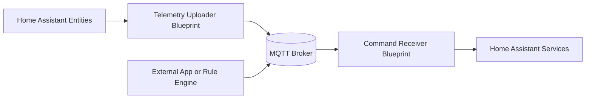
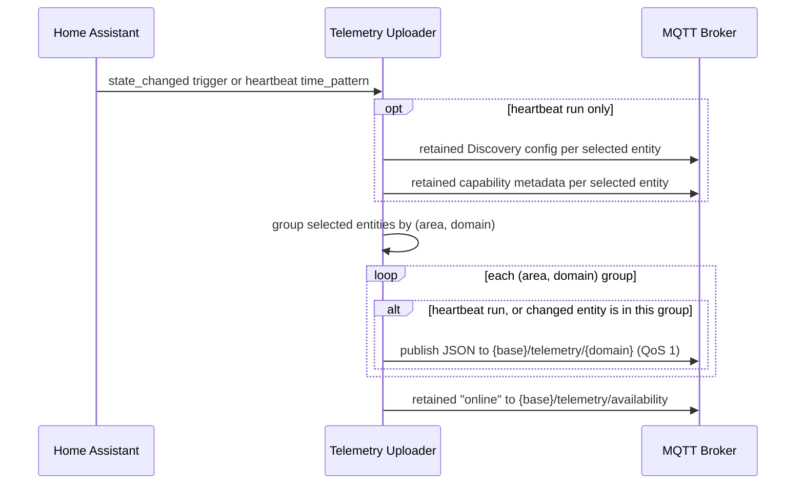
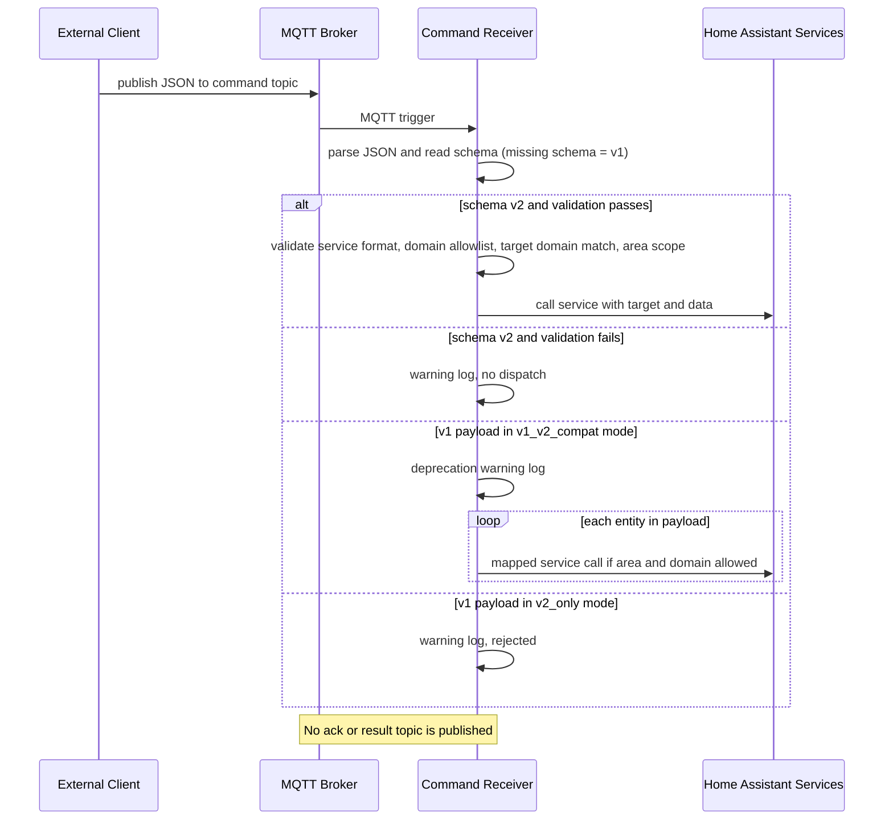

# Universal Local-First MQTT Blueprints for Home Assistant

[](https://github.com/http418imateapot/homeassistant-mqtt-blueprints/actions/workflows/blueprint-ci.yml)
[](https://github.com/http418imateapot/homeassistant-mqtt-blueprints/actions/workflows/release.yml)
[](https://github.com/http418imateapot/homeassistant-mqtt-blueprints/releases)
[](LICENSE)

English | [正體中文](README.zh-TW.md)

A plug-and-play blueprint set for bridging Home Assistant entities with a local MQTT broker.

- Local-first design: no cloud lock-in and no virtual helper sensors required.
- Standard topic structure for telemetry and commands.
- Clean JSON payloads for easy integration with gateways, dashboards, and rule engines.

## Why This Project

Home Assistant already ships MQTT-related integrations, but they solve different problems:

| | MQTT Statestream (built-in) | MQTT Discovery (built-in) | This project |
|---|---|---|---|
| Direction | One-way: HA state out | One-way: MQTT devices into HA | Two-way: telemetry out + commands in |
| Payload shape | One raw value per entity attribute topic | Device-defined | Grouped per-domain JSON with metadata (`timestamp`, `area`, `sample_type`) |
| Command handling | None | Device-defined | Schema v2 envelope (`service`, `target`, `data`) validated before dispatch |
| Command allowlist | None | None | Area and domain allowlists per receiver automation |
| Machine-readable contract | None | Discovery config only | Retained capability metadata (`read_contract` / `write_contract`) per entity |
| Setup | `configuration.yaml` | Device firmware/integration | Two importable blueprints, UI-configured |

Use this project when an external gateway, dashboard, or rule engine needs structured JSON
telemetry from Home Assistant and a validated, allowlist-guarded way to send commands back,
without writing custom automations or exposing raw service calls.

## Blueprints

1. [mqtt_telemetry_uploader.yaml](mqtt_telemetry_uploader.yaml)
2. [mqtt_command_receiver.yaml](mqtt_command_receiver.yaml)

## Features

- Telemetry uploader groups selected entities by area and domain, then publishes strict per-domain JSON payloads to `{mqtt_base_topic}/telemetry/{domain}`.
- Telemetry payloads distinguish real state events from periodic heartbeat snapshots via `sample_type` (`event` / `heartbeat`).
- Telemetry uploader publishes retained MQTT Discovery configs and retained capability metadata (read/write contract) per selected entity.
- Command receiver is schema v2 first and dispatches Home Assistant-native service calls using `service`, `target`, and `data`.
- Command receiver enforces whitelist controls by area and domain:
  - Area filter: `All Areas` + `Allowed Areas`
  - Domain filter: `Allowed Domains` (`all`, `climate`, `cover`, `fan`, `light`, `lock`, `switch`)
- Command schema compatibility controls:
  - `Command Schema Mode`: `v1_v2_compat` or `v2_only`
  - `Schema v1 Deprecation Timeline`: log display only for migration messaging
- Logs are safe by default: debug logs do not print full payloads; optional verbose mode shows command field names only.

## Architecture


```mermaid
flowchart LR
  A[Home Assistant Entities] --> B[Telemetry Uploader Blueprint]
  B --> C[(MQTT Broker)]
  D[External App or Rule Engine] --> C
  C --> E[Command Receiver Blueprint]
  E --> F[Home Assistant Services]
```

### Telemetry Publish Flow


```mermaid
sequenceDiagram
    participant HA as Home Assistant
    participant UP as Telemetry Uploader
    participant MQ as MQTT Broker
    HA->>UP: state_changed trigger or heartbeat time_pattern
    opt heartbeat run only
        UP->>MQ: retained Discovery config per selected entity
        UP->>MQ: retained capability metadata per selected entity
    end
    UP->>UP: group selected entities by (area, domain)
    loop each (area, domain) group
        alt heartbeat run, or changed entity is in this group
            UP->>MQ: publish JSON to {base}/telemetry/{domain} (QoS 1)
        end
    end
    UP->>MQ: retained "online" to {base}/telemetry/availability
```

### Command Receive Flow


```mermaid
sequenceDiagram
    participant EXT as External Client
    participant MQ as MQTT Broker
    participant RX as Command Receiver
    participant HA as Home Assistant Services
    EXT->>MQ: publish JSON to command topic
    MQ->>RX: MQTT trigger
    RX->>RX: parse JSON and read schema (missing schema = v1)
    alt schema v2 and validation passes
        RX->>RX: validate service format, domain allowlist, target domain match, area scope
        RX->>HA: call service with target and data
    else schema v2 and validation fails
        RX->>RX: warning log, no dispatch
    else v1 payload in v1_v2_compat mode
        RX->>RX: deprecation warning log
        loop each entity in payload
            RX->>HA: mapped service call if area and domain allowed
        end
    else v1 payload in v2_only mode
        RX->>RX: warning log, rejected
    end
    Note over RX,MQ: No ack or result topic is published
```

## Quick Start

### 1. Import both blueprints

[](https://my.home-assistant.io/redirect/blueprint_import/?blueprint_url=https://raw.githubusercontent.com/http418imateapot/homeassistant-mqtt-blueprints/main/mqtt_telemetry_uploader.yaml)

[](https://my.home-assistant.io/redirect/blueprint_import/?blueprint_url=https://raw.githubusercontent.com/http418imateapot/homeassistant-mqtt-blueprints/main/mqtt_command_receiver.yaml)

Manual alternative: Settings -> Automations & Scenes -> Blueprints -> Import blueprint,
then paste the raw GitHub URL of each YAML file. Blueprint import requires a public URL.

### 2. Create the uploader automation

Create one automation from `mqtt_telemetry_uploader.yaml` and select entities per domain.

### 3. Create the receiver automation

Create one automation from `mqtt_command_receiver.yaml` and set the command topic
(keep it as `{mqtt_base_topic}/commands`, default `homeassistant/commands`), then configure:

- `All Areas`: enabled means the area filter is bypassed.
- `Allowed Areas`: used only when `All Areas` is disabled.
- `Allowed Domains`: supports `all`, `climate`, `cover`, `fan`, `light`, `lock`, `switch`.

### 4. Send a first command

```bash
mosquitto_pub -h 127.0.0.1 -t "homeassistant/commands" \
  -m '{"schema":"v2","service":"light.turn_on","target":{"entity_id":["light.desk_light"]},"data":{"brightness_pct":60}}'
```

### 5. Verify telemetry

```bash
mosquitto_sub -h 127.0.0.1 -t "homeassistant/telemetry/#" -v
```

Expected payload shape:

```json
{
  "timestamp": "2026-06-20T12:34:56.789000Z",
  "area": "living_room",
  "trigger_reason": "state_changed",
  "sample_type": "event",
  "telemetries": [
    {
      "name": "state",
      "value": "on",
      "entity": "light.desk_light",
      "friendly_name": "Desk Light",
      "domain": "light",
      "unit": null
    }
  ]
}
```

Use `sample_type` on the subscriber side to distinguish event-driven updates (`event`)
from heartbeat snapshots (`heartbeat`).

## Topics and Payloads at a Glance

| Purpose | Topic | Retained | Direction |
|---|---|---|---|
| Telemetry | `{mqtt_base_topic}/telemetry/{domain}` | No | HA -> broker |
| Availability | `{mqtt_base_topic}/telemetry/availability` | Yes | HA -> broker |
| Commands (schema v2) | `{mqtt_command_topic}` (default `homeassistant/commands`) | - | broker -> HA |
| Discovery config | `{mqtt_discovery_prefix}/{component}/mqtt_bridge/{domain}_{object_id}/config` | Yes | HA -> broker |
| Capability metadata | `{mqtt_base_topic}/telemetry/capabilities/{entity_id_with_slash}` | Yes | HA -> broker |

Command envelope (schema v2):

```json
{
  "schema": "v2",
  "service": "climate.set_temperature",
  "target": { "entity_id": ["climate.bedroom_ac"] },
  "data": { "temperature": 24 }
}
```

Full topic conventions, per-domain telemetry examples, command v2 contract, capability and
discovery payloads, and the deprecated v1 format are documented in the
[MQTT Contract Reference](docs/mqtt-contract.md).

## Limitations

- Supported domains are fixed to eight: read/write `switch`, `light`, `climate`, `cover`, `fan`, `lock`; read-only `sensor`, `binary_sensor`.
- Telemetry is published with QoS 1 and not retained; Discovery configs, capability metadata, and the availability topic are retained.
- The receiver publishes no acknowledgement or result topic. Rejections are only visible in the Home Assistant system log.
- Heartbeat interval offers predefined options `/1`, `/5`, `/10`, `/30` (HA `time_pattern` minutes syntax); custom values such as `/15` are also accepted.
- Discovery configs and capability metadata are (re)published only on heartbeat-triggered runs, not on state changes.
- Discovery maps all non-`binary_sensor` domains to the `sensor` component, so discovered entities are read-only state mirrors.
- Both automations run in `parallel` mode with at most 20 concurrent runs; very large entity selections in a single uploader automation increase per-run template work.
- The uploader writes one warning-level log line per run with the grouped entity count.
- Minimum Home Assistant version: not declared by the blueprints; a recent Home Assistant release is recommended.

## Testing

End-to-end test payloads (`mosquitto_pub` / `mosquitto_sub`, bash and PowerShell), expected
event and heartbeat payloads, and a troubleshooting section are in the
[Testing Guide](docs/testing.md).

Repository-level validation (same as CI) is one command pair away; see
[Local Repository Validation](docs/testing.md#local-repository-validation-same-as-ci).

## Documentation

- [MQTT Contract Reference](docs/mqtt-contract.md): topics, payload schemas, command contract.
- [Testing Guide](docs/testing.md): manual tests, expected payloads, troubleshooting.
- [Release Process](docs/release.md): version files and release flow.
- [Architecture Decision Records](docs/adr/README.md): design decisions, including
  [ADR-0003 domain-based telemetry](docs/adr/ADR-0003-domain-based-telemetry.md).

## Contributing

Contributions are welcome. See [CONTRIBUTING.md](CONTRIBUTING.md) for guidelines,
the pull request checklist, and local validation commands, and
[CODE_OF_CONDUCT.md](CODE_OF_CONDUCT.md) for community standards.
Design decisions are tracked as [ADRs](docs/adr/README.md).

## Security

- Keep MQTT broker access local/VPN-only when possible.
- Use username/password and TLS on production brokers.
- Do not commit secrets or runtime files to this repository.

To report a vulnerability, see [SECURITY.md](SECURITY.md).

## Versioning and Changelog

Current version: see [VERSION](VERSION). Release history: see [CHANGELOG.md](CHANGELOG.md).
Release flow details are in [docs/release.md](docs/release.md).

## License

This project is licensed under the [Apache License 2.0](LICENSE).
