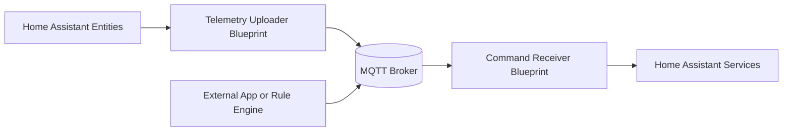
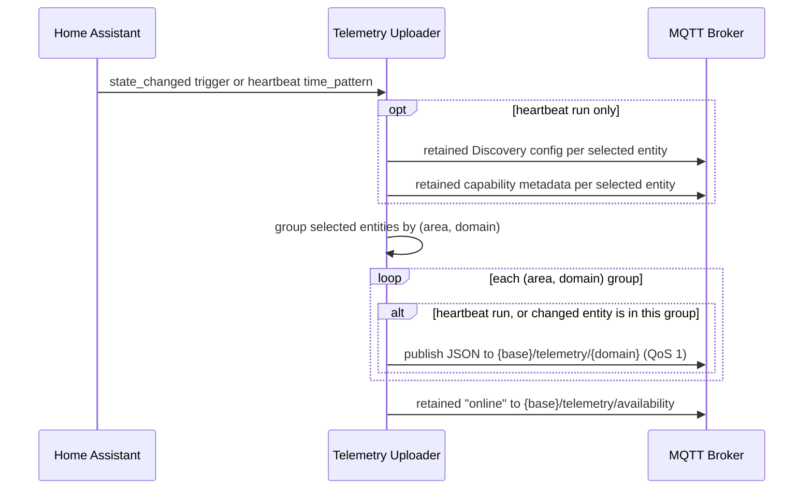
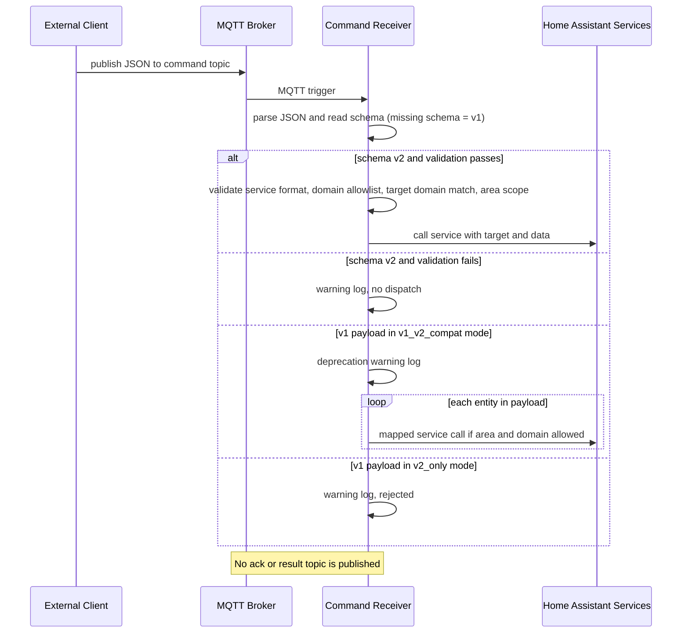

# Universal Local-First MQTT Blueprints for Home Assistant

[](https://github.com/http418imateapot/homeassistant-mqtt-blueprints/actions/workflows/blueprint-ci.yml)
[](https://github.com/http418imateapot/homeassistant-mqtt-blueprints/actions/workflows/release.yml)
[](https://github.com/http418imateapot/homeassistant-mqtt-blueprints/releases)
[](LICENSE)

[English](README.md) | 正體中文

隨插即用的 Home Assistant 自動化藍圖（blueprint）組合，用於將 Home Assistant 實體（entity）與本地 MQTT broker 橋接：

1. [mqtt_telemetry_uploader.yaml](mqtt_telemetry_uploader.yaml) 發布分組遙測（telemetry）、保留（retained）的 MQTT Discovery config 與保留的 capability metadata。
2. [mqtt_command_receiver.yaml](mqtt_command_receiver.yaml) 接收 schema v2 JSON 命令，在 area/domain 白名單保護下派送 Home Assistant 服務呼叫。

## 為何需要這個專案

Home Assistant 內建的 MQTT 相關整合解決的是不同的問題：

| | MQTT Statestream（內建） | MQTT Discovery（內建） | 本專案 |
|---|---|---|---|
| 方向 | 單向：HA 狀態輸出 | 單向：MQTT 裝置匯入 HA | 雙向：遙測輸出 + 命令輸入 |
| Payload 形式 | 每個實體屬性各一個原始值 topic | 由裝置定義 | 依 domain 分組的 JSON，含 metadata（`timestamp`、`area`、`sample_type`） |
| 命令處理 | 無 | 由裝置定義 | Schema v2 信封（`service`、`target`、`data`），派送前先驗證 |
| 命令白名單 | 無 | 無 | 每個接收器自動化可設定 area 與 domain 白名單 |
| 機器可讀契約 | 無 | 僅 Discovery config | 每個實體發布保留的 capability metadata（`read_contract` / `write_contract`） |
| 安裝方式 | `configuration.yaml` | 裝置韌體／整合 | 兩份可匯入的 blueprint，透過 UI 設定 |

當外部閘道器、儀表板或規則引擎需要從 Home Assistant 取得結構化 JSON 遙測，並以受白名單保護、
經過驗證的方式回送命令，且不想自行撰寫自動化或直接暴露服務呼叫時，即適合使用本專案。

### 功能特色

- 本地優先（local-first）設計：不綁定雲端服務，也不需要建立虛擬輔助感測器。
- 遙測上傳器將所選實體依 area 與 domain 分組，發布嚴格定義的 per-domain JSON payload 至 `{mqtt_base_topic}/telemetry/{domain}`。
- 遙測 payload 以 `sample_type`（`event` / `heartbeat`）區分真實狀態事件與週期性心跳（heartbeat）快照。
- 遙測上傳器為每個所選實體發布保留的 MQTT Discovery config 與保留的 capability metadata（讀寫契約）。
- 命令接收器以 schema v2 為主，使用 `service`、`target`、`data` 直接派送 Home Assistant 原生服務呼叫。
- 命令接收器強制執行 area 與 domain 白名單控制：
  - Area 過濾：`All Areas` + `Allowed Areas`
  - Domain 過濾：`Allowed Domains`（`all`、`climate`、`cover`、`fan`、`light`、`lock`、`switch`）
- 命令 schema 相容性控制（遷移方式請見 [v1 -> v2 遷移指南](docs/migration-guide-v1-to-v2.md)）：
  - `Command Schema Mode`：`v1_v2_compat` 或 `v2_only`
  - `Schema v1 Deprecation Timeline`：僅用於遷移提示的日誌顯示
- 日誌預設安全：除錯日誌不會列印完整 payload；選用的詳細模式僅顯示命令欄位名稱。

## 快速開始

### 1. 匯入兩份藍圖

[](https://my.home-assistant.io/redirect/blueprint_import/?blueprint_url=https://raw.githubusercontent.com/http418imateapot/homeassistant-mqtt-blueprints/main/mqtt_telemetry_uploader.yaml)

[](https://my.home-assistant.io/redirect/blueprint_import/?blueprint_url=https://raw.githubusercontent.com/http418imateapot/homeassistant-mqtt-blueprints/main/mqtt_command_receiver.yaml)

手動方式：設定 -> 自動化與場景 -> 藍圖 -> 匯入藍圖，貼上各 YAML 檔案的
raw GitHub URL。藍圖匯入需要可公開存取的 URL。

### 2. 建立上傳器自動化

以 `mqtt_telemetry_uploader.yaml` 建立一個自動化，並依 domain 選取實體。

### 3. 建立接收器自動化

以 `mqtt_command_receiver.yaml` 建立一個自動化，設定命令 topic
（保持為 `{mqtt_base_topic}/commands`，預設 `homeassistant/commands`），並設定：

- `All Areas`：啟用時略過 area 過濾。
- `Allowed Areas`：僅在 `All Areas` 停用時生效。
- `Allowed Domains`：支援 `all`、`climate`、`cover`、`fan`、`light`、`lock`、`switch`。
- `Verbose Debug Logs`：選用的詳細除錯欄位，便於疑難排解。

### 4. 送出第一筆命令

```bash
mosquitto_pub -h 127.0.0.1 -t "homeassistant/commands" \
  -m '{"schema":"v2","service":"light.turn_on","target":{"entity_id":["light.desk_light"]},"data":{"brightness_pct":60}}'
```

### 5. 驗證遙測

```bash
mosquitto_sub -h 127.0.0.1 -t "homeassistant/telemetry/#" -v
```

預期的 payload 形式：

```json
{
  "timestamp": "2026-06-20T12:34:56.789000Z",
  "area": "living_room",
  "trigger_reason": "state_changed",
  "sample_type": "event",
  "telemetries": [
    {
      "name": "state",
      "value": "on",
      "entity": "light.desk_light",
      "friendly_name": "Desk Light",
      "domain": "light",
      "unit": null
    }
  ]
}
```

訂閱端可利用 `sample_type` 區分事件驅動更新（`event`）與心跳快照（`heartbeat`）。

## 架構



### 遙測發布流程



### 命令接收流程



### Topic 與 Payload 一覽

| 用途 | Topic | 保留 | 方向 |
|---|---|---|---|
| 遙測 | `{mqtt_base_topic}/telemetry/{domain}` | 否 | HA -> broker |
| 可用性 | `{mqtt_base_topic}/telemetry/availability` | 是 | HA -> broker |
| 命令（schema v2） | `{mqtt_command_topic}`（預設 `homeassistant/commands`） | - | broker -> HA |
| Discovery config | `{mqtt_discovery_prefix}/{component}/mqtt_bridge/{domain}_{object_id}/config` | 是 | HA -> broker |
| Capability metadata | `{mqtt_base_topic}/telemetry/capabilities/{entity_id_with_slash}` | 是 | HA -> broker |

命令信封（schema v2）：

```json
{
  "schema": "v2",
  "service": "climate.set_temperature",
  "target": { "entity_id": ["climate.bedroom_ac"] },
  "data": { "temperature": 24 }
}
```

完整的 topic 規約、各 domain 遙測範例、命令 v2 契約、capability 與 discovery payload，
以及已棄用的 v1 格式，請見 [MQTT 契約參考](docs/mqtt-contract.md)。

## 限制

- 支援的 domain 固定為八種：可讀寫 `switch`、`light`、`climate`、`cover`、`fan`、`lock`；唯讀 `sensor`、`binary_sensor`。
- 遙測以 QoS 1 發布且不保留；Discovery config、capability metadata 與可用性 topic 為保留訊息。
- 接收器不會發布任何確認（ack）或結果（result）topic；命令被拒絕時僅記錄於 Home Assistant 系統日誌。
- 心跳間隔提供預設選項 `/1`、`/5`、`/10`、`/30`（HA `time_pattern` 分鐘語法）；亦接受自訂值（例如 `/15`）。
- Discovery config 與 capability metadata 僅在心跳觸發的執行中（重新）發布，狀態變更不會觸發。
- Discovery 將所有非 `binary_sensor` 的 domain 對應到 `sensor` 元件，因此被探索出的實體僅為唯讀的狀態鏡射。
- 兩個自動化皆以 `parallel` 模式執行、上限 20 個並行；單一上傳器自動化選取過多實體會增加每次執行的模板運算量。
- 上傳器每次執行都會寫入一行 warning 等級的分組實體數量日誌。
- 最低 Home Assistant 版本：blueprint 未宣告；建議使用近期的 Home Assistant 版本。

Home Assistant、MQTT broker 與各 domain 能力的支援細節，請見[支援矩陣](docs/support-matrix.md)。

## 測試

端對端測試 payload（`mosquitto_pub` / `mosquitto_sub`，含 bash 與 PowerShell）、預期的
event 與 heartbeat payload，以及疑難排解章節，請見[測試指南](docs/testing.md)。

儲存庫層級驗證（與 CI 相同）僅需兩個命令；請見
[本地儲存庫驗證](docs/testing.md#local-repository-validation-same-as-ci)。

## 貢獻

歡迎貢獻。請參閱 [CONTRIBUTING.md](CONTRIBUTING.md) 了解貢獻準則、
Pull Request 檢查清單與本地驗證命令，並參閱
[CODE_OF_CONDUCT.md](CODE_OF_CONDUCT.md) 了解社群規範。

### 文件

- [MQTT 契約參考](docs/mqtt-contract.md)：topic、payload schema、命令契約。
- [命令 Schema v1 -> v2 遷移指南](docs/migration-guide-v1-to-v2.md)：schema 比較、遷移步驟與對映範例。
- [支援矩陣](docs/support-matrix.md)：Home Assistant、MQTT broker 與各 domain 能力支援。
- [測試指南](docs/testing.md)：手動測試、預期 payload、疑難排解。
- [發版流程](docs/release.md)：版本檔案與發布流程。
- [架構決策記錄（ADR）](docs/adr/README.md)：設計決策，包含
  [ADR-0003 domain-based telemetry](docs/adr/ADR-0003-domain-based-telemetry.md)。

### 安全性

- 盡可能將 MQTT broker 存取限制於本地或 VPN。
- 正式環境的 broker 請使用帳號密碼與 TLS。
- 請勿將任何密鑰或執行期檔案提交至本儲存庫。

回報安全性弱點請見 [SECURITY.md](SECURITY.md)。

### 版本與更新日誌

目前版本請見 [VERSION](VERSION)，發布歷史請見 [CHANGELOG.md](CHANGELOG.md)。
發版流程細節請見 [docs/release.md](docs/release.md)。

## 授權

本專案採用 [Apache License 2.0](LICENSE) 授權。
