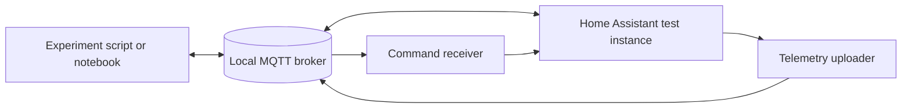

# Experiment Guide

The five experiments provide matching script and Jupyter Notebook versions. Each numbered step
states its purpose, execution, expected result, and actual result. The MQTT labs use only behavior
implemented by `mqtt_telemetry_uploader.yaml` and `mqtt_command_receiver.yaml`.

Related documents: [Example Index](../examples/README.md) | [Testing Guide](testing.md) |
[MQTT Contract Reference](mqtt-contract.md)

## Environment Topology



Python 3.10+ is required. Install Mosquitto for labs 01-04. A Home Assistant test instance is
optional for checking connections and offline payload construction, but is required to produce
telemetry, dispatch commands, record rejection logs, and publish retained metadata.

```bash
python -m pip install -r examples/requirements.txt
```

The broker defaults to `127.0.0.1:1883`. Override it with command options or the `MQTT_HOST`,
`MQTT_PORT`, `MQTT_USERNAME`, and `MQTT_PASSWORD` environment variables. Do not commit broker
credentials. Before labs 02 or 03, use test entities and review commands that can change device state.

## Running Modes

Run every step with a final summary:

```bash
bash examples/scripts/lab05_unit_testing/run_all.sh
```

```bat
examples\scripts\lab05_unit_testing\run_all.bat
```

Run a single numbered step:

```bash
python -m examples.scripts.lab05_unit_testing.step_03_run_single_param
```

Open the matching notebook under `examples/notebooks/` and use **Run All** for the cell-by-cell
version. Committed notebooks have no outputs. MQTT connection failures become a visible skipped
result so a notebook can still execute from top to bottom.

## Lab 01: Telemetry Subscription

Purpose: subscribe to `{base}/telemetry/#`, identify per-domain telemetry, and distinguish real
state events from heartbeat snapshots.

1. `step_01_connect` opens and closes an authenticated broker connection.
2. `step_02_subscribe_validate` validates `timestamp`, `area`, `trigger_reason`, `sample_type`, and
   `telemetries`. Each telemetry record must use the fixed `name`, `value`, `entity`,
   `friendly_name`, `domain`, and `unit` fields.

Expected output reports counts for `event` and `heartbeat`. An event requires
`trigger_reason=state_changed`; a heartbeat requires `trigger_reason=heartbeat`. If no per-domain
message arrives, change a selected entity state or wait for the configured heartbeat interval.

## Lab 02: Schema v2 Commands

Purpose: build and publish one command for each writable domain: `light`, `switch`, `climate`,
`cover`, `fan`, and `lock`.

1. `step_01_build_validate` displays six envelopes and checks `schema=v2`, `service` in
   `domain.service` form, mapping `target` and `data`, and matching service/entity domains.
2. `step_02_publish` sends the envelopes to `homeassistant/commands` by default with QoS 1.

Expected output lists six published services. The receiver also checks its configured Allowed
Domains and area scope. It forwards the requested service after validation; Home Assistant remains
responsible for whether that service and data are valid for the target entity.

## Lab 03: Allowlist and Rejection

Purpose: exercise rejection conditions without claiming an MQTT response that the blueprint does
not implement.

1. `step_01_build_scenarios` creates a switch command for a receiver configured to allow only
   `light`, a `light` service targeting a `switch`, and a v1 mapping for `v2_only` mode.
2. `step_02_publish_observe` publishes all scenarios and directs the operator to Home Assistant
   **Settings > System > Logs**.

Expected output confirms publication only. Rejections are `system_log.write` warnings. There is no
acknowledgement or result topic, so MQTT-side silence is expected.

## Lab 04: Retained Metadata

Purpose: read retained MQTT Discovery config and capability metadata produced on heartbeat runs.

1. `step_01_connect_topics` derives `{discovery_prefix}/+/mqtt_bridge/+/config` and
   `{base}/telemetry/capabilities/#` subscriptions.
2. `step_02_read_validate` checks Discovery state/availability fields and capability `entity`,
   `domain`, `area`, `read_contract`, and `write_contract` fields.

Expected output lists discovered object IDs and each entity's write schema. Writable domains expose
schema v2 and command target fields; `sensor` and `binary_sensor` have a null write schema. If no
metadata arrives, enable the uploader, select entities, and wait for a heartbeat-triggered run.

## Lab 05: Unit Testing

Purpose: teach pytest using the real tests under `tests/`, without a duplicate example suite.

1. `step_01_arrange_act_assert` collects tests and identifies Arrange, Act, Assert in a validator test.
2. `step_02_run_suite` executes all repository unit tests.
3. `step_03_run_single_param` selects only the uploader parameter of the parallel-mode test.
4. `step_04_read_failure` creates a temporary intentional failure and explains the assertion diff and
   short summary. The expected pytest exit code 1 is converted into a successful teaching step.

Expected output includes the collected node IDs, the full pass summary, one selected pass, and a
clearly labelled expected failure. See [Testing Guide](testing.md#unit-tests) for direct commands.

## Troubleshooting

### Broker connection fails

Start Mosquitto, confirm the listener and firewall, then verify host, port, username, and password.
Scripts print a `FAILED` actual result and return nonzero without a traceback. Notebooks print
`SKIPPED` and continue.

### Connected but no telemetry or metadata appears

Enable the corresponding Home Assistant automation and select entities in the uploader. State
changes produce event telemetry. Heartbeats produce snapshots, Discovery config, and capability
metadata. Retained metadata does not exist until at least one heartbeat run completes.

### Commands produce no visible MQTT response

This is expected. Check the Home Assistant system log for rejection details and verify receiver
Allowed Domains, Allowed Areas, Command Schema Mode, and command topic configuration.

### pytest cannot create its temporary directory

The lab uses repository-local `--basetemp=.pytest-tmp`. For direct runs on a locked-down Windows
host, add the same option: `python -m pytest tests -q --basetemp=.pytest-tmp`.